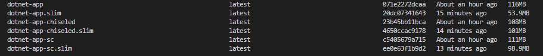

# .NET with Docker

This directory contains Dockerfiles for building and deploying .NET applications. You can choose the appropriate
Dockerfile based on your needs.

## Files Included

#### 1. [Dockerfile](./Dockerfile)

-   Produces the recommend image using `mcr.microsoft.com/dotnet/aspnet:8.0-alpine` as the base image.

#### 2. [Dockerfile_chiseled](./Dockerfile_chiseled)

-   Uses the `mcr.microsoft.com/dotnet/runtime-deps:8.0-jammy-chiseled` base image.
-   Ideal for highly secure and minimal environments.

#### 3. [Dockerfile_self_contained](./Dockerfile_self_contained)

-   Based on `mcr.microsoft.com/dotnet/runtime-deps:8.0-alpine`.

Heres a comparison of the image sizes. The `.slim` images are built using Docker Slim.



## Add a .dockerignore File

Copy the [.dockerignore](.dockerignore) file in the root of your project.

## Building the Docker Image

#### Using the Regular Dockerfile

```bash
docker build -t dotnet-app .
```

#### Using Dockerfile_chiseled

```bash
docker build -f Dockerfile_chiseled -t dotnet-app .
```

#### Using Dockerfile_self_contained

```bash
docker build -f Dockerfile_self_contained -t dotnet-app .
```

## Using Docker Slim (Optional)

We can use Docker Slim to reduce the size further.

**Note**: docker slim can remove some files that are required for your application to run. So, it is recommended to test
the application after using Docker Slim.

```bash
docker run --rm -it -v /var/run/docker.sock:/var/run/docker.sock dslim/slim build --target dotnet-app
```

## Running the Docker Container

Once the image is built, run the container using:

```bash
docker run -p 5000:5001 dotnet-app
```

Replace `dotnet-app` with the appropriate tag if using `chiseled` or `mcr` versions.

## Contributing

If you have ideas for improving or adding new Docker configurations for .NET, feel free to contribute by opening a pull
request.

---

## References

-   https://www.mytechramblings.com/posts/testing-chiseled-ubuntu-containers-with-dotnet/
-   https://andrewlock.net/exploring-the-dotnet-8-preview-updates-to-docker-images-in-dotnet-8/
-   https://medium.com/@jeroenverhaeghe/creating-smaller-and-more-secure-docker-images-for-net-core-8c74101e9027
