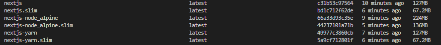

# Next.js App with Docker Support

This repository includes a Dockerfile to build and run your Next.js application. This repository aims to provide the
smallest possible Docker image for your Next.js application. Follow the steps below to configure your project for Docker
support.

## Files Included

#### 1. [Dockerfile](Dockerfile)

-   This uses alpine as the base image and installs nodejs and uses npm.

#### 2. [Dockerfile_yarn](Dockerfile_yarn)

-   Same as the Dockerfile but uses yarn instead of npm.

#### 3. [Dockerfile_node_alpine](Dockerfile_node_alpine)

-   This uses node:alpine as the base image.

Heres a comparison of the image sizes. The `.slim` images are built using Docker Slim.



## Setup Instructions

### 1. Add a Standalone Script to `package.json`

Add the following script to your `package.json` file under the `scripts` section:

```json
"standalone": "next build && cp -r public/ .next/standalone && cp -r .next/static .next/standalone/.next",
```

We'll be using nextjs's `standalone` script to prepare the necessary files for a production-ready application. This
script will copy the `public` directory and the `static` directory to the `.next/standalone` directory so that we don't
need to copy them manually in the final Docker image. Read more about
[nextjs standalone here](https://nextjs.org/docs/pages/api-reference/next-config-js/output).

### 2. Update `next.config.ts`

Create or update your `next.config.ts` file and add the output property with the value `standalone`:

```typescript
import type { NextConfig } from "next";

const nextConfig: NextConfig = {
    output: "standalone",
};

export default nextConfig;
```

### 3. Add a `.dockerignore` File

Copy the [.dockerignore](.dockerignore) file in the root of your project.

### 4. Build the Docker Image

#### Using the Regular Dockerfile

```bash
docker build -t nextjs .
```

#### Using the Dockerfile_node_alpine

```bash
docker build -f Dockerfile_node_alpine -t nextjs .
```

#### Using the Dockerfile_yarn

```bash
docker build -f Dockerfile_yarn -t nextjs .
```

Replace `nextjs` with the desired name for your Docker image.

### 5 Using Docker Slim (Optional)

We can use Docker Slim to reduce the size further.

**Note**: docker slim can remove some files that are required for your application to run. So, it is recommended to test
the application after using Docker Slim.

```bash
docker run --rm -it -v /var/run/docker.sock:/var/run/docker.sock dslim/slim build --target nextjs
```

### 6. Run the Docker Container

Once the Docker image is built, you can run the container using the following command:

```bash
docker run -p 3000:3000 nextjs
```

## Additional Notes

-   Ensure you have Docker installed and running on your system.
-   The `standalone` script prepares the necessary files for a production-ready Docker build.
-   Customize the Dockerfile as needed for your specific deployment requirements.

You're now ready to run your Next.js app using Docker!

---

## References

-   [Distroless alpine image](https://github.com/astefanutti/scratch-node)
-   https://nextjs.org/docs/pages/api-reference/next-config-js/output
-   https://medium.com/@techwithtwin/dockerizing-next-js-v14-application-using-output-standalone-and-self-hos-eb636aa9b441
