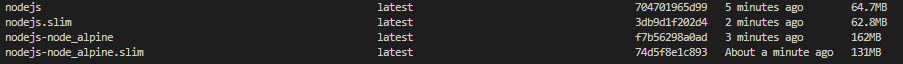

# Node.js with Docker

This directory provides a Dockerfile to containerize your Node.js application for development and production use. This
example uses an express server, but you can modify it to fit your needs.

## Files Included

#### 1. [Dockerfile](Dockerfile)

-   This file uses alpine as the base image and installs nodejs manually.

#### 2. [Dockerfile_node_alpine](Dockerfile_node_alpine)

-   This version uses node:alpine as the base image.

Heres a comparison of the image sizes. The `.slim` images are built using Docker Slim.



## Setup Instructions

### 1. Add a `.dockerignore` File

Copy the [`.dockerignore`](.dockerignore) file in the root of your project.

### 2. Dockerfile

Create a [Dockerfile](Dockerfile) in the root of your project. This file contains the necessary commands to build the
Docker image.

### 3. Build the Docker Image

#### Using the Generic Dockerfile

```bash
docker build -t nodejs .
```

#### Using the Dockerfile_node_alpine

```bash
docker build -f Dockerfile_node_alpine -t nodejs .
```

### 4. Using Docker Slim (Optional)

We can use Docker Slim to reduce the size further.

**Note**: docker slim can remove some files that are required for your application to run. So, it is recommended to test
the application after using Docker Slim.

```bash
docker run --rm -it -v /var/run/docker.sock:/var/run/docker.sock dslim/slim build --target nodejs
```

### 5. Run the Docker Container

Once the image is built, run the container with:

```bash
docker run -p 3000:3000 nodejs
```

Replace `nodejs` with your desired image name.

## Contributing

If you have suggestions or enhancements for this Docker setup, feel free to open a pull request.

---

## References

-   https://github.com/vercel/ncc
-   https://webbylab.com/blog/minimal-size-docker-image-for-your-nodejs-app/
