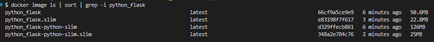

# Python Flask with Docker

This directory provides a Dockerfile to containerize your Python Flask application for both development and production
use. This example uses Flask as the web framework, but you can modify it to fit your needs.

## Files Included

#### 1. [Dockerfile](Dockerfile)

-   This file uses `python:alpine` as the base image and installs Flask and dependencies manually.

#### 2. [Dockerfile_python_slim](Dockerfile_python_slim)

-   This version uses `python:slim` as the base image to reduce the size of the image while still supporting Flask.

Here’s a comparison of the image sizes. The `.slim` images are built using Docker Slim.



## Setup Instructions

### 1. Add a `.dockerignore` File

Copy the [`.dockerignore`](.dockerignore) file to the root of your project.

### 2. Dockerfile

Create a [Dockerfile](Dockerfile) in the root of your project. This file contains the necessary commands to build the
Docker image.

### 3. Build the Docker Image

#### Using the Generic Dockerfile

```bash
docker build -t python_flask .
```

#### Using the Dockerfile_python_slim

```bash
docker build -f Dockerfile_python_slim -t python_flask .
```

### 4. Using Docker Slim (Optional)

We can use Docker Slim to reduce the size of the image further.

Note: Docker Slim can remove some files that are required for your application to run. It is recommended to test the
application thoroughly after using Docker Slim to ensure everything works as expected.

```bash
docker run --rm -it -v /var/run/docker.sock:/var/run/docker.sock dslim/slim build --target python_flask
```

### 5. Run the Docker Container

Once the image is built, run the container with:

```bash
docker run -p 5000:5000 python_flask
```

### Contributing

If you have suggestions or enhancements for this Docker setup, feel free to open a pull request.

---

## References

-   https://www.sobyte.net/post/2022-05/py-docker/
