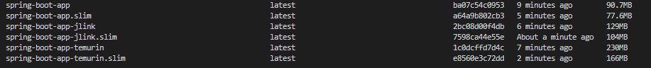

# Spring Boot with Docker

This directory provides multiple Dockerfiles for containerizing your Spring Boot application. Choose the appropriate
Dockerfile based on your requirements.

## Files Included

#### 1. [Dockerfile](./Dockerfile)

-   Builds a lightweight Docker image for your Spring Boot application.
-   Utilizes `jdeps` to analyze dependencies and include only the required modules in the JRE.

#### 2. [Dockerfile_EclipseTemurin](./Dockerfile_EclipseTemurin)

-   Uses the `eclipse-temurin` base image to build and run your Spring Boot application.
-   Ideal for environments requiring the Eclipse Temurin JDK.

#### 3. [Dockerfile_Jlink](./Dockerfile_Jlink)

-   Builds a custom JRE using `jlink` with the `--add-modules=ALL-MODULE-PATH` flag.
-   Includes all Java modules in the JRE.
-   Suitable for scenarios needing a full-featured JRE.

Heres a comparison of the image sizes. The `.slim` images are built using Docker Slim. 



## Setup Instructions

### 1. Add a [.dockerignore](./.dockerignore) File

Copy the [`.dockerignore`](.dockerignore) file in the root of your project.

### 2. Dockerfile

Create a [Dockerfile](Dockerfile) in the root of your project. This file contains the necessary commands to build the
Docker image.

### 3. Building the Docker Image

#### Using the Regular Dockerfile

```bash
docker build -t spring-boot-app .
```

#### Using Dockerfile_EclipseTemurin

```bash
docker build -f Dockerfile_EclipseTemurin -t spring-boot-app:temurin .
```

#### Using Dockerfile_Jlink

```bash
docker build -f Dockerfile_Jlink -t spring-boot-app:jlink .
```

### 4. Using Docker Slim (Optional)

We can use Docker Slim to reduce the size further.

**Note**: docker slim can remove some files that are required for your application to run. So, it is recommended to test
the application after using Docker Slim.

```bash
docker run --rm -it -v /var/run/docker.sock:/var/run/docker.sock dslim/slim build --target spring-boot-app
```

## Running the Docker Container

After building the image, run the container with:

```bash
docker run -p 8080:8080 spring-boot-app
```

Replace `spring-boot-app` with the appropriate tag if using the `EclipseTemurin` or `Jlink` version.

## Contributing

If you have additional configurations or optimizations for Spring Boot Dockerfiles, feel free to submit a pull request.

---

## References

-   https://snyk.io/blog/jlink-create-docker-images-spring-boot-java/
-   https://medium.com/@RoussiAbdelghani/optimizing-java-base-docker-images-size-from-674mb-to-58mb-c1b7c911f622
