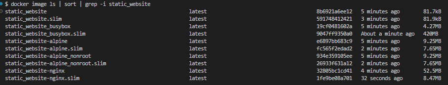

# Static Files with Docker

This directory provides Dockerfiles for deploying an application to serve static files. It doesn't only work for static website but also for any static files that you want to serve.

## FIles Included

#### 1. [Dockerfile](Dockerfile)

-   Use a custom built busybox image as the base image.

#### 2. [Dockerfile_alpine](Dockerfile_alpine)

-   This uses `alpine:3.20` as the base image. It uses the root user to run the application. See the
    [Dockerfile_alpine_nonroot](Dockerfile_alpine_nonroot) file for a non-root user version.

#### 3. [Dockerfile_alpine_nonroot](Dockerfile_alpine_nonroot)

-   This uses `alpine:3.20` as the base image. It uses a non-root user to run the application.

#### 4. [Dockerfile_busybox](Dockerfile_busybox)

-   This uses `busybox` as the base image.

#### 5. [Dockerfile_nginx](Dockerfile_nginx)

-   Uses `nginx:alpine` as the base image.

Heres a comparison of the image sizes. The `.slim` images are built using Docker Slim.

Yup, you saw that right, the `Dockerfile` is Kilobytes in size!



## Setup Instructions

### 1. Add a `.dockerignore` File

Copy the [`.dockerignore`](.dockerignore) file in the root of your project.

### 2. Add an `nginx.conf` File (Optional)

Create an [`nginx.conf`](nginx.conf) file in the root of your project.

**Note: Only use this file if you are using one of the NGINX Dockerfiles.**

### 3. Build the Docker Image

#### Using the General Dockerfile

```bash
docker build -t static_website .
```

#### Using the Alpine Dockerfile

```bash
docker build -f Dockerfile_alpine -t static_website .
```

#### Using the Alpine Non-Root Dockerfile

```bash
docker build -f Dockerfile_alpine_nonroot -t static_website .
```

#### Using the Busybox Dockerfile

```bash
docker build -f Dockerfile_busybox -t static_website .
```

#### Using the NGINX Dockerfile

```bash
docker build -f Dockerfile_nginx -t static_website .
```

### 4. Using Docker Slim (Optional)

We can use Docker Slim to reduce the size further.

**Note**: docker slim can remove some files that are required for your application to run. So, it is recommended to test
the application after using Docker Slim.

For the docker files that uses nginx, run the following command:

```bash
docker run --rm -it -v /var/run/docker.sock:/var/run/docker.sock dslim/slim build --target static_website --include-path /var/www/html --include-path /var/log/nginx --include-path /var/lib/nginx --include-path /run/nginx
```

For others (non busybox), run the following command:

```bash
docker run --rm -it -v /var/run/docker.sock:/var/run/docker.sock dslim/slim build --target static_website --include-path /var/www/html
```

After successfully running the above command, you will see a new image with name `static_website.slim` in your Docker

## Running the Container

After building the image, run the container using the following command:

```bash
docker run -p 3000:80 static_website
```

## Contributing

If you have improvements or additional configurations for the static files setup, feel free to open a pull request!

---

## References

-   https://lipanski.com/posts/smallest-docker-image-static_website
-   https://github.com/lipanski/docker-static_website/tree/master
