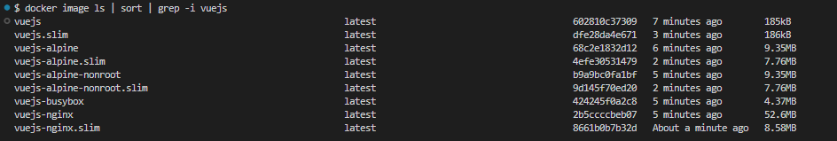

# Vue.js Vite with Docker

This directory provides Dockerfiles for deploying a Vue.js application. You can choose between several
configurations tailored to your needs.

---

## Files Included

### 1. [Dockerfile](Dockerfile)

-   Uses a custom-built BusyBox image as the base image.

### 2. [Dockerfile_alpine](Dockerfile_alpine)

-   Uses `alpine:3.20` as the base image. The application runs as the root user. For a non-root version, refer to the
    [Dockerfile_alpine_nonroot](Dockerfile_alpine_nonroot) file.

### 3. [Dockerfile_alpine_nonroot](Dockerfile_alpine_nonroot)

-   Also based on `alpine:3.20`, but configured to run the application as a non-root user.

### 4. [Dockerfile_busybox](Dockerfile_busybox)

-   Uses `busybox` as the base image, optimized for extremely small image sizes.

### 5. [Dockerfile_nginx](Dockerfile_nginx)

-   Uses `nginx:alpine` as the base image for serving the Vue.js Vite application with NGINX.

---

## Image Size Comparison

Here’s a comparison of the resulting image sizes. The `.slim` images are created using Docker Slim for further
optimization.

Yes, you read that right! The `Dockerfile` creates an image measured in kilobytes!



---

## Setup Instructions

### 1. Add a `.dockerignore` File

Copy the [`.dockerignore`](.dockerignore) file to the root of your project to exclude unnecessary files from your image.

### 2. Add an `nginx.conf` File (Optional)

If you're using one of the NGINX-based Dockerfiles, create an [`nginx.conf`](nginx.conf) file in the root of your
project.

### 3. Build the Docker Image

#### General Dockerfile

```bash
docker build -t vuejs .
```

#### Alpine Dockerfile

```bash
docker build -f Dockerfile_alpine -t vuejs .
```

#### Alpine Non-Root Dockerfile

```bash
docker build -f Dockerfile_alpine_nonroot -t vuejs .
```

#### Busybox Dockerfile

```bash
docker build -f Dockerfile_busybox -t vuejs .
```

#### NGINX Dockerfile

```bash
docker build -f Dockerfile_nginx -t vuejs .
```

---

## Optimizing with Docker Slim (Optional)

Use Docker Slim to further reduce the image size.

**Note**: Docker Slim might remove essential files. Test your application thoroughly after slimming down the image.

#### For `Dockerfile_alpine_nonroot`

```bash
docker run --rm -it -v /var/run/docker.sock:/var/run/docker.sock dslim/slim build --target vuejs --include-path /var/www/html --include-path /var/log/nginx --include-path /var/lib/nginx --include-path /run/nginx
```

#### For Other Dockerfiles (excluding BusyBox)

```bash
docker run --rm -it -v /var/run/docker.sock:/var/run/docker.sock dslim/slim build --target vuejs --include-path /var/www/html
```

After successfully running the above commands, you will see a new image named `vuejs.slim` in your Docker images.

---

## Running the Container

After building the image, you can run the container with the following command:

```bash
docker run -p 3000:80 vuejs
```

---

## Contributing

If you have improvements or additional configurations for the Vue.js Vite setup, feel free to open a pull request!

---

## References

-   https://lipanski.com/posts/smallest-docker-image-static-website
-   https://github.com/lipanski/docker-static-website/tree/master
-   https://www.geeksforgeeks.org/how-to-run-nginx-for-root-non-root/
-   https://medium.com/@pierre.fourny/optimized-docker-setup-for-vite-powered-react-apps-e7b7f5a82bb4
-   https://youtu.be/t779DVjCKCs?si=xSdHkSH6YaZ7h54i
